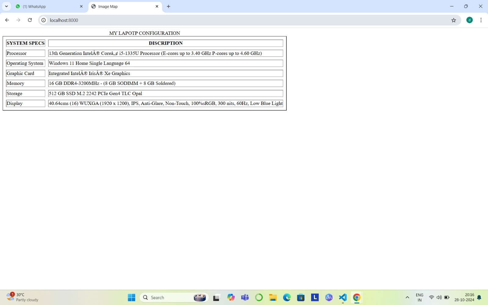

# EX01 Developing a Simple Webserver
## Date: 11-11-2024

## AIM:
To develop a simple webserver to serve html pages and display the configuration details of laptop.

## DESIGN STEPS:
### Step 1: 
HTML content creation.

### Step 2:
Design of webserver workflow.

### Step 3:
Implementation using Python code.

### Step 4:
Serving the HTML pages.

### Step 5:
Testing the webserver.

## PROGRAM:
```
from http.server import HTTPServer,BaseHTTPRequestHandler
content = """
<!DOCTYPE html>
<html>
     <title> Image Map </title>
     <body>
          <table border = "2" cellspacing = "10" cellpading = "6">
               <caption> MY LAPOTP CONFIGURATION </caption>
               <tr>
                    <th>SYSTEM SPECS</th>
                    <th>DISCRIPTION</th>
               </tr>
               <tr>
                    <td>Processor</td>
                    <td>13th Generation Intel® Core™ i5-1335U Processor (E-cores up to 3.40 GHz P-cores up to 4.60 GHz)</td>
               </tr>
               <tr>
                    <td>Operating System</td>
                    <td>Windows 11 Home Single Language 64</td>
               </tr>
               <tr>
                    <td>Graphic Card</td>
                    <td>Integrated Intel® Iris® Xe Graphics</td>
               </tr>
               <tr>
                    <td>Memory</td>
                    <td>16 GB DDR4-3200MHz - (8 GB SODIMM + 8 GB Soldered)</td>
               </tr>
               <tr>
                    <td>Storage</td>
                    <td>512 GB SSD M.2 2242 PCIe Gen4 TLC Opal</td>
               </tr>
               <tr>
                    <td>Display</td>
                    <td>40.64cms (16) WUXGA (1920 x 1200), IPS, Anti-Glare, Non-Touch, 100%sRGB, 300 nits, 60Hz, Low Blue Light</td>
               </tr> 
          </table>
     </body>
</html>
"""
class myhandler(BaseHTTPRequestHandler):
    def do_GET(self):
        print("request received")
        self.send_response(200)
        self.send_header('content-type', 'text/html; charset=utf-8')
        self.end_headers()
        self.wfile.write(content.encode())
server_address = ('',8000)
httpd = HTTPServer(server_address,myhandler)
print("my webserver is running...")
httpd.serve_forever()
```


## OUTPUT:

.png>)

## RESULT:
The program for implementing simple webserver is executed successfully.
